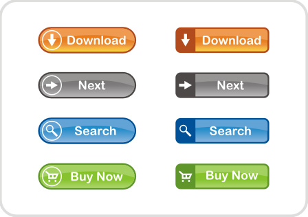

#Description

The easy configurable statefullness plugin that can get all of your buttons to much higher user frendliness!

##When to use

The main reason I created that plugin was due to the observation in my proffesional expirience that shows how many people tend to split hate to many web pages that are actually not bad, without actually taking account of what is wrong. In actuality, even if everything was working fine but when the connection is slow sometimes the data is fetched after 10 seconds and in that time people want to know whether something is currently working or it just bugged. That is the occasion where you would like to use the statefullness.

* Supports almost all of the webpages (uses jquery and bootstrap from version 1 up to latest version with all of the differences)
* Support is easy to be handled (you call the function setState(object,state) whenever you like)
*  Customisable style (it is explained in a way which does not require any knowledge of programming to grasp)

### Installation

1. Go to the folder. 

2. Copy it to your scrpt folder.

3. Attach the script to your webpage (  ).

#### Example Usage

The way it works and explanation is shown right here : http://www.jilanov.com/projects/statefull.html

## Contact

[Dimitar Jilanov](http://jilanov.com)   
[@DimitarJilanov](https://twitter.com/DimiturJilanov)

## License

Statefull buttons is available under the MIT license. See the LICENSE file for more info.

## Special thanks 

Special thanks to Emil Katzarski for the inspiration for it!

Special thanks to Stefo Danchovski for the documentation assistance while creating it!
